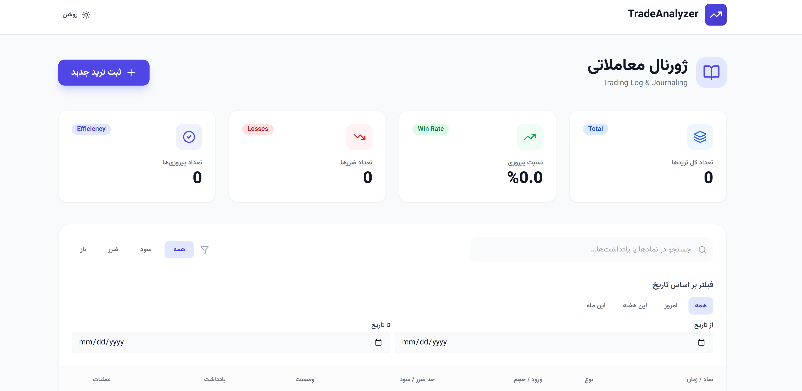
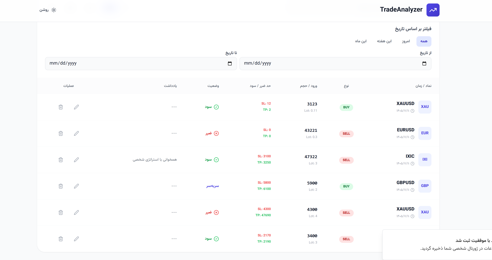
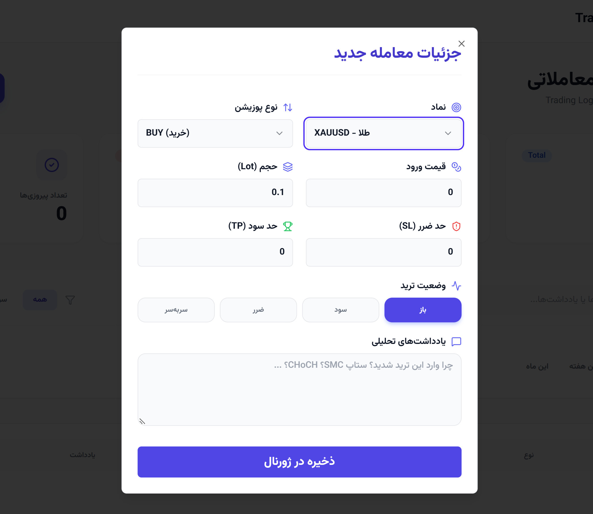

# Trade Journal

A web app for traders to log their trades, review performance, and improve their strategy over time. Record every trade with its details, keep your trading setups organized, track key stats on a dashboard, and use built-in tools to support your decisions.

## Screenshots

### Dashboard



### Journal



### New trade




## Features

- **Dashboard** — performance overview with stats cards and charts
- **Trading journal** — a table of all your trades, with a quick form to add a new trade
- **Setups** — define and organize the trading setups and strategies you use
- **Tools** — helpful utilities for planning and managing trades
- **Market prices** — a price service to bring market data into the app
- **Notifications** — a notifications panel to keep you informed
- **Settings** — customize the app to fit your workflow
- **Responsive UI** — works on desktop and mobile
- **Deployment ready** — Netlify configuration included

## Tech Stack

**Frontend**
- React 18 + TypeScript, built with Vite
- React Router and TanStack Query
- Tailwind CSS and shadcn/ui (Radix UI)
- Recharts for charts and statistics
- Framer Motion for animations
- React Hook Form and Zod for forms and validation

**Backend**
- Node.js + Express 5 + TypeScript

**Tooling and deployment**
- pnpm
- Vitest for unit tests
- Prettier and TypeScript type checking
- Netlify (static client + serverless API via `serverless-http`)

## Project Structure

```
trade-journal
├─ client/                  # React app
│  ├─ components/           # Header, NewTradeModal, NotificationsPanel,
│  │                        # StatsCard, TradingTable, ui/ (shadcn/ui)
│  ├─ hooks/                # use-mobile, use-toast
│  ├─ lib/                  # utils
│  ├─ pages/                # Dashboard, Journal, TradingJournal, Setups,
│  │                        # Tools, Settings, NotFound
│  └─ services/             # journalService, priceService
├─ server/                  # Express API
│  ├─ routes/               # API routes
│  ├─ index.ts              # Server entry
│  └─ node-build.ts         # Production server entry
├─ shared/                  # Types shared by client and server
├─ netlify/functions/       # Serverless API entry for Netlify
└─ netlify.toml
```

## Getting Started

### Prerequisites

- Node.js 18+
- pnpm

### Installation

```bash
git clone https://github.com/mohjavad333/Trade-journal-app
cd trade-journal
pnpm install
```

### Environment variables

If the app needs configuration (for example API keys for a market data provider), create a `.env` file in the project root:

```env
# Add the values your services need
```

### Run in development

```bash
pnpm dev
```

### Build and run in production

```bash
pnpm build
pnpm start
```

## Scripts

| Command | Description |
| --- | --- |
| `pnpm test` | Run unit tests with Vitest |
| `pnpm typecheck` | Run the TypeScript compiler |
| `pnpm format.fix` | Format the codebase with Prettier |

## Deployment

The repo includes `netlify.toml` and `netlify/functions/api.ts`, so the app can be deployed on Netlify with the API running as a serverless function. Set any environment variables in your Netlify site settings.

## Roadmap

- [ ] Import trades from CSV or broker exports
- [ ] Advanced analytics (win rate, risk/reward, drawdown)
- [ ] Trade screenshots and notes
- [ ] User accounts and cloud sync
- [ ] Dark mode


## Author

**Mohammad Javad Rezaei**
GitHub: [@mohjavad333](https://github.com/mohjavad333/Trade-journal-app)